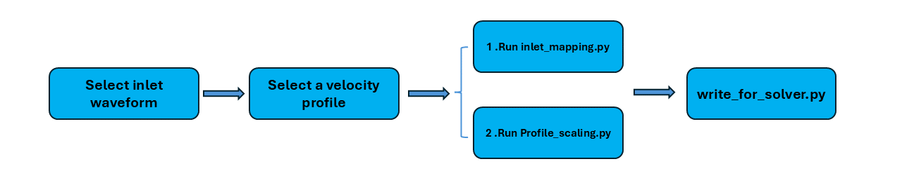
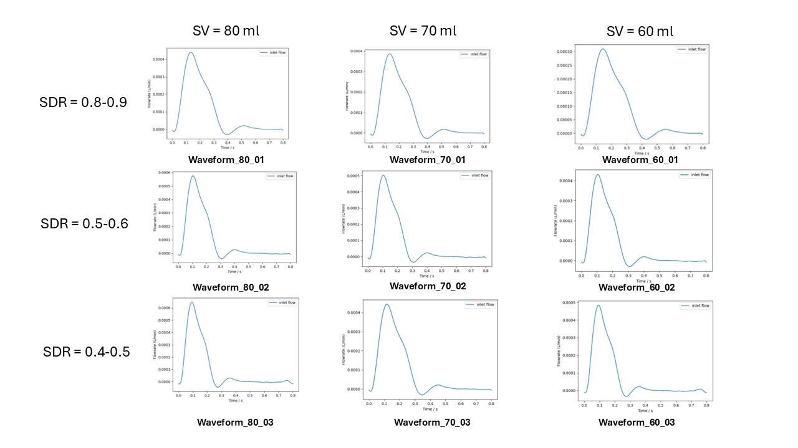
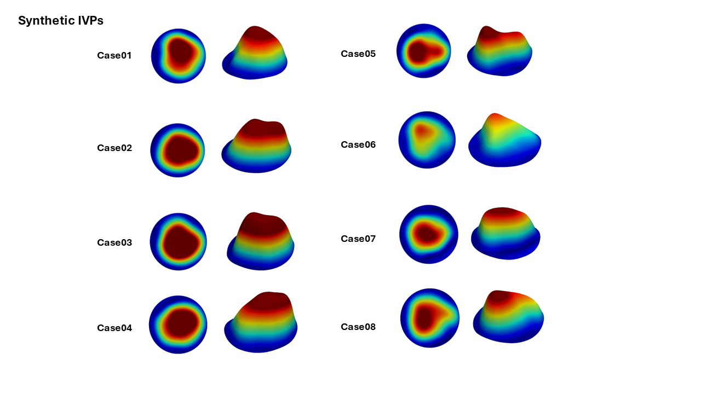

# Personalizing-3DIVP-TBAD
This code is to used to personalize synthetic 3D IVPs for computational studies in TBAD.  
Workflow for applying synthetic IVPs:

## Seclet a waveform  
Select an appraporiate inlet flow waveform based on stoke volume (SV) and systole-to-disatole ratio (SDR). 

## Select a syntheic profile
8 different synthetic profiles are provided in this repo. Pick 1 for mapping.

## 3EWM tuning
The mean flowrate from Profile_scaling.py is outputted for 3EWM tuning.

## Reach out for more specific inlet waveforms and synthetic profiles. 
email: k.wang21@imperial.ac.uk
